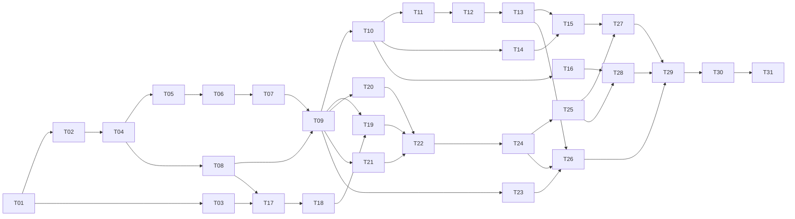

# Tổng hợp task — Xác thực, phân quyền, quản lý tài khoản

Plan gốc: [`../2026-10-06-authn-authz-account-management.md`](../2026-10-06-authn-authz-account-management.md)
Tài liệu thiết kế chi tiết (route, mã lỗi, luồng xử lý): `../../../Docs/[AUTH] AuthenAtho - Module Xác thực, Phân quyền và Quản lý tài khoản.docx`

Plan được chia thành 31 task nhỏ, mỗi task một file, mỗi task làm xong trong khoảng 0.5–1.5 ngày. Thứ tự đã sắp theo phụ thuộc: làm từ trong ra ngoài (Domain → Application → Infrastructure → WebAPI → kiểm thử tích hợp), đúng hướng phụ thuộc của Clean Architecture.

## Cách làm một task

1. Đọc file task, mục **Bối cảnh** và phần tài liệu thiết kế được nhắc tới.
2. Nếu thiếu kiến thức ở mục **Kiến thức cần có**, đọc phần tương ứng ở cuối file này trước.
3. Tạo branch riêng: `feature/auth-T05-entity-group`.
4. Làm theo **Việc cần làm**; chữ ký/tên gợi ý có thể điều chỉnh nhưng phải ghi rõ lý do trong PR.
5. Trước khi mở PR: `dotnet build`, `dotnet test`, `dotnet format` đều qua; tick hết **Tiêu chí hoàn thành**.
6. Commit theo conventional commits, ví dụ `feat(domain): add Group entity with permission grant/revoke`.
7. Gặp chỗ ghi **"hỏi lead"** / **"chờ xác nhận"** → hỏi trước, không tự quyết.

## Sơ đồ phụ thuộc

Có thể làm song song khi có 2 người: nhánh Application (T11–T16) và nhánh Infrastructure (T17–T21) cùng bắt đầu sau T09/T10; T23 làm bất kỳ lúc nào sau T09.

## Danh sách task

### Giai đoạn 0 — Chuẩn bị (~1.5 ngày)

| Mã | Task | Mục tiêu | Kiến thức cần có | Phụ thuộc | Ước lượng |
|---|---|---|---|---|---|
| [T01](T01-chay-solution-va-postgres.md) | Làm quen solution, chạy API và PostgreSQL | Build/run được solution, có DB local, hiểu 4 layer | Terminal, git, `dotnet` CLI, Docker cơ bản | — | 0.5 ngày |
| [T02](T02-tao-test-projects.md) | Tạo project unit test | Có `Domain.Tests`, `Application.Tests` chạy xanh | xUnit, Arrange–Act–Assert | T01 | 0.5 ngày |
| [T03](T03-them-nuget-packages.md) | Thêm NuGet packages | Đúng package vào đúng layer | NuGet, quy tắc phụ thuộc giữa layer | T01 | 0.5 ngày |

### Giai đoạn 1 — Domain (~3.5 ngày)

| Mã | Task | Mục tiêu | Kiến thức cần có | Phụ thuộc | Ước lượng |
|---|---|---|---|---|---|
| [T04](T04-domain-exception-va-permissions.md) | `DomainException` + `Permissions` | Một nguồn sự thật duy nhất cho mã quyền | `static class`, `const`, reflection cơ bản | T02 | 0.5 ngày |
| [T05](T05-entity-permission-group.md) | Entity `Permission`, `Group` | Gán/thu hồi quyền trên entity, bảo vệ nhóm hệ thống | Encapsulation, backing field, n-n | T04 | 1 ngày |
| [T06](T06-entity-user.md) | Entity `User` | Tạo, khóa/mở, gán nhóm, gộp quyền | Như T05, LINQ `SelectMany` | T05 | 1 ngày |
| [T07](T07-user-lockout.md) | Lockout trên `User` | Khóa tạm thời khi sai mật khẩu nhiều lần | `DateTimeOffset`, `[Theory]` | T06 | 0.5 ngày |
| [T08](T08-entity-refresh-token.md) | Entity `RefreshToken` | Lưu hash token, revoke, kiểm tra còn hiệu lực | Access vs refresh token | T04 | 0.5 ngày |

### Giai đoạn 2 — Application (~8 ngày)

| Mã | Task | Mục tiêu | Kiến thức cần có | Phụ thuộc | Ước lượng |
|---|---|---|---|---|---|
| [T09](T09-application-exceptions-va-interfaces.md) | Exception + interface | Hợp đồng giữa Application và hạ tầng | DIP, async/await, Repository, Unit of Work | T05–T08 | 1 ngày |
| [T10](T10-dto-validators-options.md) | DTO, validator, options, `AddApplication` | Request/response rõ ràng, validate tập trung | `record`, FluentValidation, Options pattern, DI | T09 | 1 ngày |
| [T11](T11-authservice-login.md) | `AuthService.LoginAsync` | Đăng nhập an toàn, cấp token | Mock (NSubstitute/Moq), JWT khái niệm | T10 | 1 ngày |
| [T12](T12-authservice-refresh.md) | `AuthService.RefreshAsync` | Xoay vòng refresh token, phát hiện dùng lại | Token rotation, transaction | T11 | 1 ngày |
| [T13](T13-authservice-logout-change-password.md) | Logout + đổi mật khẩu | Thu hồi token, đổi mật khẩu của chính mình | Idempotent, `ICurrentUser` | T12 | 0.5–1 ngày |
| [T14](T14-userservice-crud.md) | `UserService` CRUD | Danh sách, chi tiết, tạo, sửa tài khoản | Mapping DTO, phân trang | T10 | 1 ngày |
| [T15](T15-userservice-khoa-va-gan-nhom.md) | `UserService` khóa + gán nhóm | Không bao giờ mất admin cuối cùng | Tư duy edge case | T13, T14 | 1 ngày |
| [T16](T16-groupservice-permissionservice.md) | `GroupService`, `PermissionService` | CRUD nhóm, gán quyền, đọc danh mục | LINQ tập hợp | T10 | 1–1.5 ngày |

### Giai đoạn 3 — Infrastructure (~5.5 ngày)

| Mã | Task | Mục tiêu | Kiến thức cần có | Phụ thuộc | Ước lượng |
|---|---|---|---|---|---|
| [T17](T17-dbcontext-va-entity-configurations.md) | `AppDbContext` + mapping | Map entity sang bảng PostgreSQL bằng Fluent API | EF Core Fluent API, n-n, kiểu dữ liệu PG | T03, T05–T08 | 1–1.5 ngày |
| [T18](T18-migration-initial-identity.md) | Migration `InitialIdentity` | Tạo schema DB local | EF migrations, user-secrets | T17 | 0.5 ngày |
| [T19](T19-repositories-va-unitofwork.md) | Repository + UnitOfWork | Truy vấn EF sau interface | LINQ to Entities, `Include`, tracking | T09, T18 | 1–1.5 ngày |
| [T20](T20-password-hasher-va-clock.md) | `PasswordHasher` + `SystemClock` | Băm mật khẩu bằng BCrypt | Hashing, salt, work factor | T09, T03 | 0.5 ngày |
| [T21](T21-jwt-token-service.md) | `JwtTokenService` | Tạo JWT có claim quyền, refresh token ngẫu nhiên | JWT, khóa đối xứng, SHA-256, Base64Url | T09, T03 | 1 ngày |
| [T22](T22-dbseeder-va-addinfrastructure.md) | `DbSeeder` + `AddInfrastructure` | Khởi tạo quyền, nhóm Administrator, admin | DI lifetime, scope, idempotent | T19–T21 | 1 ngày |

### Giai đoạn 4 — WebAPI (~5 ngày)

| Mã | Task | Mục tiêu | Kiến thức cần có | Phụ thuộc | Ước lượng |
|---|---|---|---|---|---|
| [T23](T23-exception-middleware-problemdetails.md) | Exception → ProblemDetails | Lỗi trả về thống nhất, không lộ thông tin | Middleware, `IExceptionHandler`, RFC 7807 | T09 | 1 ngày |
| [T24](T24-cau-hinh-jwt-authentication.md) | Cấu hình JWT + `ICurrentUser` | API xác thực được access token | AuthN vs AuthZ, `TokenValidationParameters` | T21, T22 | 1 ngày |
| [T25](T25-phan-quyen-theo-permission.md) | `[HasPermission]` | Thiếu quyền → 403, policy dựng động | Policy-based authorization | T24, T04 | 1 ngày |
| [T26](T26-auth-controller.md) | `AuthController` | 4 endpoint xác thực | ASP.NET Core controllers | T11–T13, T23, T24 | 0.5 ngày |
| [T27](T27-users-controller.md) | `UsersController` | 7 endpoint quản lý tài khoản | Route param, `CreatedAtAction` | T14, T15, T25 | 0.5–1 ngày |
| [T28](T28-groups-permissions-controller.md) | `GroupsController`, `PermissionsController` | Endpoint nhóm/quyền, xóa template mẫu | Như T27 | T16, T25 | 0.5–1 ngày |

### Giai đoạn 5 — Kiểm thử tích hợp và hoàn thiện (~2.75 ngày)

| Mã | Task | Mục tiêu | Kiến thức cần có | Phụ thuộc | Ước lượng |
|---|---|---|---|---|---|
| [T29](T29-integration-test-setup.md) | Dựng integration test | Chạy API thật trong test với DB riêng | `WebApplicationFactory`, xUnit fixture | T26–T28 | 1 ngày |
| [T30](T30-integration-test-kich-ban.md) | Kịch bản integration test | Tự động hóa 11 kịch bản nghiệm thu | `HttpClient`, đọc ProblemDetails | T29 | 1–1.5 ngày |
| [T31](T31-kiem-tra-cuoi-va-cap-nhat-tai-lieu.md) | Kiểm tra cuối + tài liệu | Mọi kiểm tra qua, tài liệu khớp code | `dotnet format`, đọc rules dự án | T30 | 0.5 ngày |

**Tổng ước lượng:** khoảng 26 ngày công cho một người (5–6 tuần với thực tập sinh), ít hơn nếu 2 người làm song song.

## Các điểm đang chờ quyết định

Task đang viết theo phương án đề xuất; nếu lead chốt khác thì sửa task tương ứng:

| Câu hỏi | Đề xuất đang dùng | Ảnh hưởng tới task |
|---|---|---|
| Đăng nhập bằng email hay username? | Email, unique | T06, T11, T17 |
| Chính sách mật khẩu và lockout | ≥ 10 ký tự; khóa 15 phút sau 5 lần sai | T07, T10 |
| Cho tự đăng ký công khai? | Không, chỉ admin tạo | T14, T26 |
| Nhóm Administrator được bảo vệ? | Có (`IsSystem`) | T05, T16 |
| Thư viện băm mật khẩu | BCrypt.Net-Next | T03, T20 |
| Package ngoài danh sách: `Microsoft.IdentityModel.JsonWebTokens`, Testcontainers, `EFCore.NamingConventions` | Hỏi lead | T03, T17, T21, T29 |

## Kiến thức nền cho junior

Không cần thành thạo hết trước khi bắt đầu — đọc phần liên quan ngay trước task cần nó.

### 1. C# và .NET (cần từ T01)
- Class, record, interface, generic, `async`/`await`, `Task`, `CancellationToken`.
- LINQ: `Where`, `Select`, `SelectMany`, `Any`, `Distinct`, `Except`.
- Nullable reference types (`string?`), vì sao không dùng `!` để tắt cảnh báo.
- Tài liệu: https://learn.microsoft.com/dotnet/csharp/

### 2. Clean Architecture và nguyên tắc thiết kế (cần từ T01, quan trọng nhất)
- 4 layer và hướng phụ thuộc `WebAPI → Infrastructure, Application → Domain`.
- SOLID, đặc biệt Dependency Inversion: Application khai báo interface, Infrastructure implement.
- Entity giàu hành vi (rich domain model) vs entity "thiếu máu" (anemic) — logic bất biến nằm trên entity.
- Đọc: `.claude/rules/design.md`; https://learn.microsoft.com/dotnet/architecture/modern-web-apps-azure/common-web-application-architectures

### 3. Unit test (cần từ T02)
- xUnit: `[Fact]`, `[Theory]`, Arrange–Act–Assert, một test kiểm một hành vi.
- Mock với NSubstitute hoặc Moq; fake object (ví dụ `FakeClock`).
- https://learn.microsoft.com/dotnet/core/testing/

### 4. Bảo mật xác thực (cần từ T07, rất quan trọng)
- Hashing vs encryption, salt, BCrypt — không bao giờ lưu/log mật khẩu.
- JWT: cấu trúc, claim, chữ ký, thời hạn; access token ngắn hạn vs refresh token.
- Refresh token rotation và reuse detection.
- Không tiết lộ thông tin qua thông báo lỗi (ví dụ "email không tồn tại").
- OWASP: Authentication, Password Storage, JWT cheat sheets — https://cheatsheetseries.owasp.org/

### 5. Phân quyền RBAC (cần từ T04)
- User ↔ Group ↔ Permission; quyền thực tế là hợp quyền các nhóm.
- Vì sao kiểm tra theo *permission* thay vì theo *tên role*.

### 6. Entity Framework Core + PostgreSQL (cần từ T17)
- `DbContext`, Fluent API, quan hệ n-n, index unique, migration.
- Tracking vs no-tracking, `Include`, phân trang `Skip/Take`.
- Lưu thời gian dạng UTC (`timestamptz`).
- https://learn.microsoft.com/ef/core/ và https://www.npgsql.org/efcore/

### 7. ASP.NET Core Web API (cần từ T23)
- Pipeline middleware và thứ tự; Dependency Injection và lifetime.
- Controller, routing, model binding, status code (200/201/204/400/401/403/404/409).
- Authentication (JwtBearer) và policy-based authorization.
- Options pattern, configuration, user-secrets.
- https://learn.microsoft.com/aspnet/core/

### 8. Quy trình làm việc của dự án
- Git branch + Pull Request, conventional commits.
- Trước commit: `dotnet build`, `dotnet test`, `dotnet format`.
- Không thêm package ngoài danh sách khi chưa hỏi; không commit secret; không sửa migration đã apply.
- Đọc: `CLAUDE.md`, `.claude/rules/workflow.md`, `.claude/rules/tech-defaults.md`.
